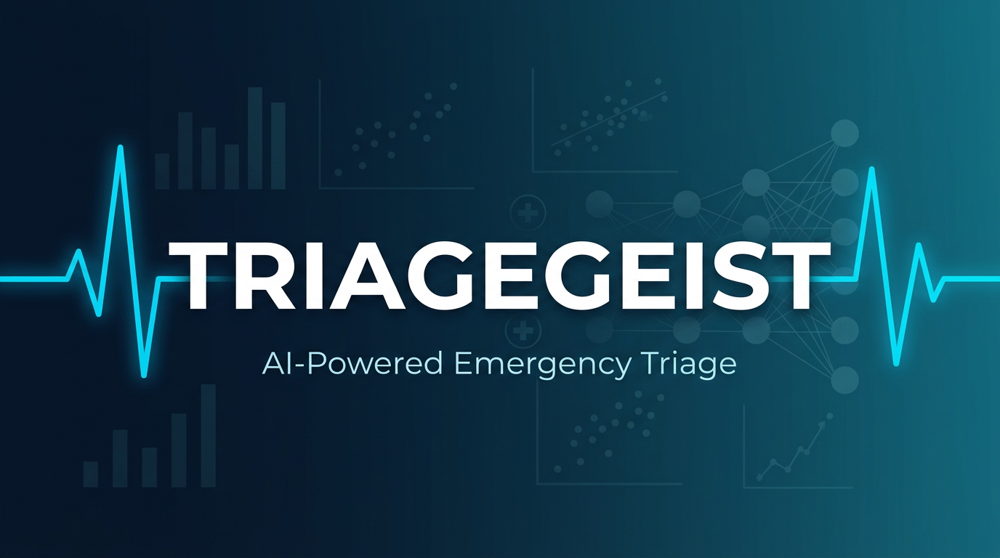

# Triagegeist: AI-Powered Emergency Triage Acuity Prediction

<p align="center">
  
</p>

**Stacked Triple-Boost Ensemble (LightGBM + XGBoost + CatBoost → LR Meta-Learner) with Clinical Feature Engineering, NLP, Cost-Sensitive Error Analysis & Demographic Bias Auditing**

Submission for the [Triagegeist Kaggle Competition](https://www.kaggle.com/competitions/triagegeist/) by the Laitinen-Fredriksson Foundation.

**[Live Demo](https://ladyfaye1998.github.io/triagegeist/)** | **[Kaggle Notebook](https://www.kaggle.com/code/ladyfaye/triagegeist-triage-acuity-prediction)** | **[Writeup](writeup.md)**

---

## Overview

This project builds a clinical decision support system that predicts Emergency Severity Index (ESI) triage acuity levels (1–5) from structured patient intake data, free-text chief complaints, and patient medical history.

### Results

| Model | Accuracy | Weighted F1 | QWK |
|:------|:--------:|:-----------:|:---:|
| LightGBM | 99.57% | 99.57% | 0.9978 |
| XGBoost | 99.44% | 99.44% | 0.9973 |
| CatBoost | 99.42% | 99.42% | 0.9972 |
| **Stacked Ensemble** | **99.59%** | **99.59%** | **0.9980** |

### Key Features

- **Multi-table data fusion** — Combines vitals, demographics, NLP text, and 25 comorbidity flags
- **50+ clinical features** — Vital sign abnormality flags, qSOFA, SIRS criteria, cardiovascular risk scores
- **NLP pipeline** — TF-IDF (500 features, trigrams, min_df=3) + 16 critical keyword regex flags on chief complaint text
- **Two-level stacking** — LightGBM + XGBoost + CatBoost base learners → Logistic Regression meta-learner on 15 OOF probability features
- **QWK threshold optimization** — Nelder-Mead on ordinal cumulative probability boundaries
- **Target encoding** — Out-of-fold target encoding for nurse and site IDs (captures inter-rater variability)
- **SHAP interpretability** — Feature-level explanations a clinician can audit
- **Clinical misclassification cost analysis** — Asymmetric cost matrix (undertriage 3× worse than overtriage)
- **Ablation study** — Quantifies each feature group's marginal contribution (vitals → demographics → history → clinical flags → NLP)
- **Calibration analysis** — Per-class reliability diagrams confirm well-calibrated confidence scores
- **Comprehensive bias analysis** — Statistical testing across 5 demographic dimensions + intersectional subgroups
- **Interactive demo** — Browser-based triage prediction at [ladyfaye1998.github.io/triagegeist](https://ladyfaye1998.github.io/triagegeist/)

## Project Structure

```
triagegeist/
├── data/                          # Competition data (not committed)
│   ├── train.csv
│   ├── test.csv
│   ├── chief_complaints.csv
│   ├── patient_history.csv
│   └── sample_submission.csv
├── notebooks/
│   └── triagegeist-triage-acuity-prediction.ipynb   # Main Kaggle notebook
├── src/
│   ├── config.py                  # Central configuration
│   ├── data_loader.py             # Data loading & merging pipeline
│   ├── feature_engineering.py     # Clinical feature engineering + NLP
│   ├── model.py                   # Model training & prediction
│   └── analysis.py                # Bias analysis & interpretability
├── docs/
│   └── index.html                 # Interactive GitHub Pages demo
├── assets/
│   └── cover_560x280.png          # Competition cover image
├── outputs/                       # Generated predictions & logs
├── writeup.md                     # Competition writeup
├── validate_pipeline.py           # End-to-end validation script
├── requirements.txt               # Python dependencies
└── README.md
```

## Setup

```bash
git clone https://github.com/ladyFaye1998/triagegeist.git
cd triagegeist
pip install -r requirements.txt
```

### Run the Notebook

```bash
cd notebooks
jupyter notebook triagegeist-triage-acuity-prediction.ipynb
```

The notebook auto-detects Kaggle vs local paths. Place competition data in `data/` for local execution.

### Run Validation

```bash
python validate_pipeline.py
```

## Feature Engineering

626+ total features across 6 categories:

| Category | Count | Examples |
|:---------|------:|:--------|
| Categorical | 12 | arrival_mode, mental_status, chief_complaint_system |
| Numeric (vitals) | 22 | heart_rate, systolic_bp, spo2, news2_score |
| Patient history | 25 | hx_hypertension, hx_diabetes_type2, hx_copd |
| Clinical flags | 50+ | qSOFA score, SIRS count, vital abnormality flags, risk composites |
| NLP (TF-IDF) | 500 | Chief complaint unigrams + bigrams + trigrams |
| NLP (keywords) | 16 | chest_pain, seizure, stroke, suicidal, respiratory_distress |

## Clinical Relevance

- **Undertriage detection** — Identifies ESI 4-5 patients who should be ESI 1-3
- **Inter-rater variability** — Target-encoded nurse IDs confirm systematic scoring differences
- **Bias monitoring** — Chi-squared tests show statistically significant accuracy differences across demographics
- **Interpretable** — SHAP explanations map predictions to clinical decision points

## Limitations

1. Trained on synthetic/competition data; requires real-world validation (MIMIC-IV-ED)
2. NEWS2 as a feature may partially encode existing triage decisions
3. TF-IDF NLP is basic; ClinicalBERT would improve semantic understanding
4. No temporal or external validation
5. Single-snapshot triage — does not model reassessment dynamics

## License

MIT

## Author

[ladyFaye1998](https://www.kaggle.com/ladyfaye)
